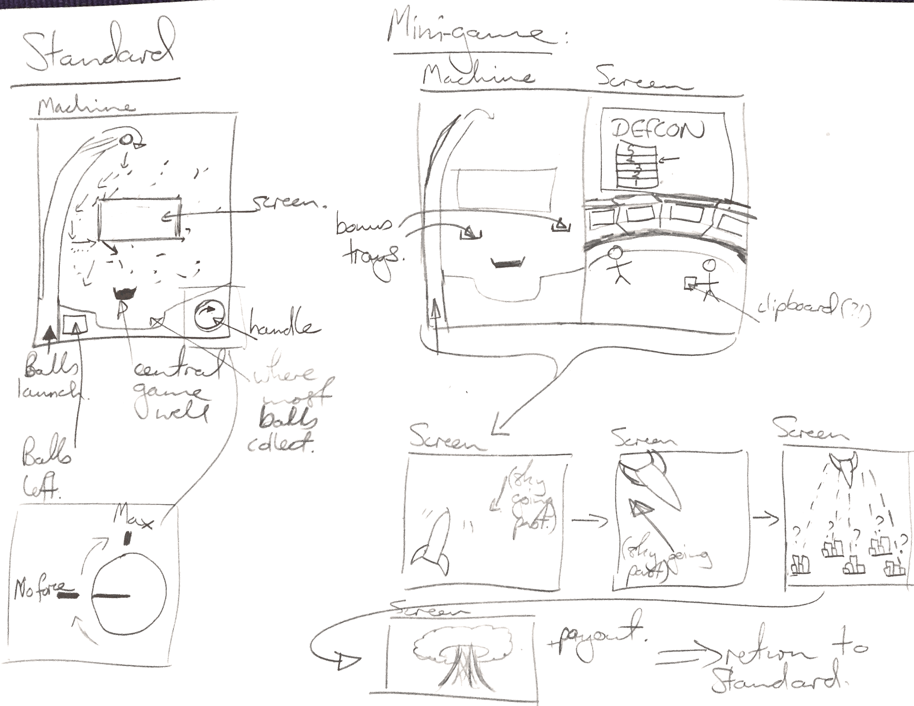

# Pachinko Design Document

## Introduction

We decided to pursue a slightly different interpretation of the instructions for the assignment and look at Pachinko - a variety of Japanese game which fills many of the same cultural niches as slot machines do in the West.

Originally a children's amusement, they soon grew to be played by adults for entertainment and, more usually, for gambling purposes. Today they are a major part of Japanese culture despite the historical blanket ban on all forms of gambling in Japan.

## Group 

* Technical Lead: Christian Guckelsberger
* Design Lead: Tom Cole
* Director of Content: Emmanuel Manoli Francis

## Pachinko Overview

Pachinko machines are vertical machines where small metal balls are shot up to the top of the board and then fall down. On their way down these balls will bounce off and run along several pins that have been embedded into the Pachinko board, which may or may not end up with them falling into 1 or more wells that trigger the machine to perform certain actions. 

The Pachinko board itself is made up of pins that are embedded into the board, a large screen in the middle of the board, and various wells for balls to fall into - but there is always a well at the bottom in the middle of the machine - this is the players main target (hereafter referred to as __the central game well__). There may be other wells present, or others that open up when the mini-game has been activated, but there is always a central well in the middle at the bottom.

Balls are placed into a well at the bottom of the machine (these balls have been 'rented' from the establishment before hand). The player then turns a handle to the right. The more this handle is turned to the right, the harder the balls are fired up to the top of the Pachinko machine. Whether this has a significant affect on the balls trajectory as they travel down the machine is open to discussion.

As these balls fall down, the player is hoping that some of them will make their way into the central game well. Once a ball enters this well the machine will start a mini-game that may result in more balls being payed out to the player. This mini-game takes place on a screen in the middle of the board and is often accompanied by lighting effects and gaudy animations. Pachinko machines are usually themed in some way and these animations often tie-in with the overall theme of the machine.

Mini-games vary massively, incorporated different stages, payout schemes, risk-reward situations and play styles. 

## Process

1. Tom to write design doc, build pachinko machine with placeholder assets in Unity. Acquire other assets such as sound, music and placeholder images.
2. Christian to program pachinko machine according to design doc.
3. Emmanuel to replace placeholder assets of the machine and central screen with more attractive and consistent art assets, add lighting effects, particles effects and animations if able.

## *This* Pachinko Machine

_Theme_: War

### Game Rules:

#### Standard Mode

1. Player receives 1000 balls at the start. StandardMode music plays (standardMode.mp3).
2. Video Screen in the middle can be static (usually it would have animation - could be added later).
1. Player uses right/left arrows to increase/decrease the clockwise-rotation of the ball-launcher handle. This is the only method of interaction for the player.
    2.  Turning the handle more to the right will increase the force with which the balls are launched.
    3.  Balls will be launched every 0.7 seconds.
2. Balls launch up the left-hand side and then fall down, hitting pins as they go.
    3.  Must be possible to launch balls so that they go down either side of the board - the right side with more force (greater clockwise rotation of the handle) or the left-side with less force (lesser clockwise roation of the handle).
4.  Balls will end up either collecting in the bottom of the machine and exiting, or falling into the central game well.
5.  When a ball falls into the central game well, the mini-game begins.
6.  Random particle effects can trigger around the board for absolutely no reason at all.

#### Mini-Game

1. When the mini-game is initiated,  two __bonus trays__ that will pop out and light-up to highlight their presence. There will also be new music that plays (minigame.mp3) to accompany the mini-game for its full duration until a return to Standard Mode. Lots of particle effects to signify this exciting development.
2. The aim of the player is to get balls to fall into either these bonus trays and the central game well.
3. The monitor in the middle of the board will show an image of a war room with a DEFCON status indicator at DEFCON 5. There will also be a timer displayed that starts to count down, starting at 60seconds.
4. For each ball that falls into the two trays or the central well, the DEFCON level will rise. If it reaches DEFCON 1 within 60 seconds, the __one bonus tray__ will retract back into the machine and the mini-game will move to the next step of the mini-game. 
    5.  If DEFCON 1 is not reached within 60 seconds, then the trays will retract and the player will return to Standard Mode.
    6.  For every ball that is collected and contributes to the DEFCON level rising, trigger particle effects/lights etc. and play 'yeah.mp3'.
6.  During the second stage of the mini-game, the monitor will show a nuclear missile being launched.
    7. For every ball that is collected in the open bonus tray or central game well, play the __explosion.wav__ effect and add one warhead to a pictogram on the screen. (this will be a bonus payout later, for now represented as the power of the nuclear missle).
    7. The missile will be shown travelling up for 25 seconds
    8. The missile will then be shown travelling down for 25 seconds.
    9. The monitor will then show 5 cities on the ground. One site shall be chosen at random, and the missile will travel there from the top middle of screen over a period of 10 seconds. At the beginning of this 10 seconds, play the __whoosh.wav__ sound effect. Upon impact, play the __bang.wav__ sound effect.
        10. If there is a city there, then it will be blown up and the player will earn 250 balls plus an extra 20 for any balls that were collected in the bonus tray or the central game well during the 60 second animation for the flight of the missile. Play the __bonus.wav__ sound effect.
        11. If there isn't a city there, there is no payout. Play the __betterLuck.mp3__ effect and return to standard mode.
    12. The destroyed cities persist between mini-games for the duration of the game. If a city is destroyed and it's the last one standing, then the player gets a super payout of 2000 balls plus a bonus 50 balls for any ball that's collected from the bonus tray or central game well during the last missile run. (_To be honest, if they've played long enough for this to happen, they deserve it._) At this point, the game ends. Show victory image (victory.jpg) and congratulations. Firework particle effects. Game Over.
13. Player returns to Standard Mode if they have not destroyed the last remaining city.

---

Ideas:

* Have different types of balls - different physics (e.g. weight/bounciness)
* [Yakuza mini-game sim:](https://www.youtube.com/watch?v=9-YscE3MmZU)
* 