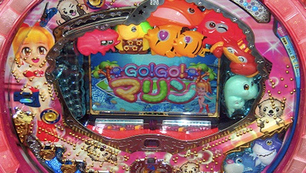

# Pachinko Design Document

[Video of game in action (YouTube)](https://youtu.be/bUsv32tCHO4)

## Introduction

We decided to pursue a slightly different interpretation of the instructions for the assignment and look at Pachinko - a variety of Japanese game which fills many of the same cultural niches as slot machines do in the West.

Originally a children's amusement, they soon grew to be played by adults for entertainment and, more usually, for gambling purposes. Today they are a major part of Japanese culture despite the historical blanket ban on all forms of gambling in Japan.

## Group 

* Technical Lead: Christian Guckelsberger
* Design Lead: Tom Cole
* Director of Content: Emmanuel Manoli Francis

## Pachinko Overview

Pachinko machines are vertical machines where small metal balls are shot up to the top of the board and then fall down. On their way down these balls will bounce off and run along several pins that have been embedded into the Pachinko board, which may or may not end up with them falling into 1 or more wells that trigger the machine to perform certain actions. 

The Pachinko board itself is made up of pins that are embedded into the board, a large screen in the middle of the board, and various wells for balls to fall into - but there is always a well at the bottom in the middle of the machine - this is the players main target (hereafter referred to as __the central game well__). There may be other wells present, or others that open up when the mini-game has been activated, but there is always a central well in the middle at the bottom.

Balls are placed into a well at the bottom of the machine (these balls have been 'rented' from the establishment before hand). The player then turns a handle to the right. The more this handle is turned to the right, the harder the balls are fired up to the top of the Pachinko machine. Whether this has a significant affect on the balls trajectory as they travel down the machine is open to discussion.

As these balls fall down, the player is hoping that some of them will make their way into the central game well. Once a ball enters this well the machine will start a mini-game that may result in more balls being payed out to the player. This mini-game takes place on a screen in the middle of the board and is often accompanied by lighting effects and gaudy animations. Pachinko machines are usually themed in some way and these animations often tie-in with the overall theme of the machine.

Mini-games vary massively, incorporated different stages, payout schemes, risk-reward situations and play styles. 

## Process

1. Tom to write design doc, build pachinko machine with placeholder assets in Unity. Acquire other assets such as sound, music and placeholder images.
2. Christian to program pachinko machine according to design doc.
3. Emmanuel to replace placeholder assets of the machine and central screen with more attractive and consistent art assets, add lighting effects, particles effects and animations if able.

## *This* Pachinko Machine

_Theme_: War

_Controls_: Move the mouse left/right to decrease/increase the force with which the balls are launched (this is indicated by the rotation of the handle in the bottom right).

### Game Rules:

#### Standard Mode

1. Player receives 1000 balls at the start. StandardMode music plays (standardMode.mp3). 
2. Video Screen in the middle can be static (usually it would have animation - could be added later).
1. Player uses right/left arrows to increase/decrease the clockwise-rotation of the ball-launcher handle. This is the only method of interaction for the player.
    2.  Turning the handle more to the right will increase the force with which the balls are launched.
    3.  Balls will be launched every 0.7 seconds.
2. Balls launch up the left-hand side and then fall down, hitting pins as they go.
    3.  Must be possible to launch balls so that they go down either side of the board - the right side with more force (greater clockwise rotation of the handle) or the left-side with less force (lesser clockwise roation of the handle).
4.  Balls will end up either collecting in the bottom of the machine and exiting (via an explosion), or falling into the central game well.
5.  When a ball falls into the central game well, the mini-game begins.
6.  Random particle effects can trigger around the board for absolutely no reason at all - eye candy is good!

#### Mini-Game

1. When the mini-game is initiated,  two __bonus trays__ that will pop out and light-up to highlight their presence. There will also be new music that plays (minigame.mp3) to accompany the mini-game for its full duration until a return to Standard Mode. Lots of particle effects to signify this exciting development.
2. The aim of the player is to get balls to fall into either these bonus trays. For any further balls that fall into the central game well, the player will received an extra 10 balls.
3. The middle screen shows a series of 5 different images - each one corresponding to the 5 levels of Defense Condition (or DEFCON) that lead to war. In this case - nuclear armageddon.
4. The mini-game starts at DEFCON 5.
	1. The player needs to get at least one ball in both trays in order to progress to the next level of DEFCON (a decrease in number to level 1).
	2. The player has 20 seconds to do so. A countdown can be seen in the bottom left. A sound will play when the player is successful in getting a ball into either bonus tray.
		1. If the player succeeds in getting a ball in both trays within 20 seconds, they will go to the next level of DEFCON (5 -> 4 -> 3 -> 2 -> 1).
		2. If the player fails to get a ball in both trays within 20 seconds, they will drop back to the last level fo DEFCON. If they player was at DEFCON 5, the mini-game will exit and the machine will go back to Standard Mode.
		3. If a player reaches DEFCON 1 and manages to get balls into both bonus trays, 'nuclear armageddon' results and the player is rewarded with 1000 extra balls. The machine then returns back to standard mode.

